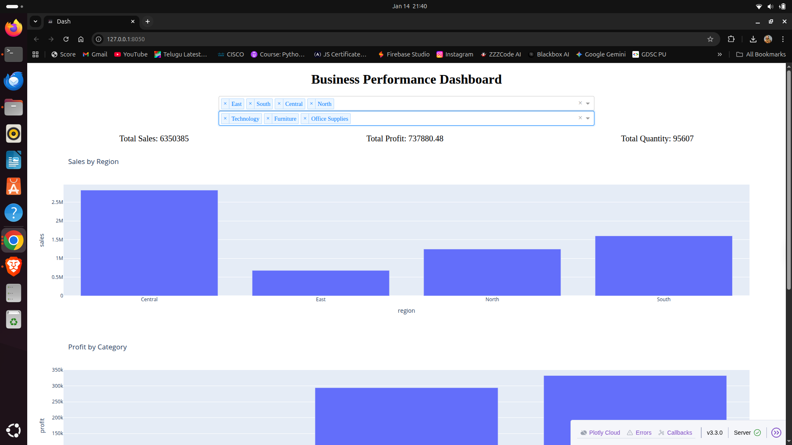
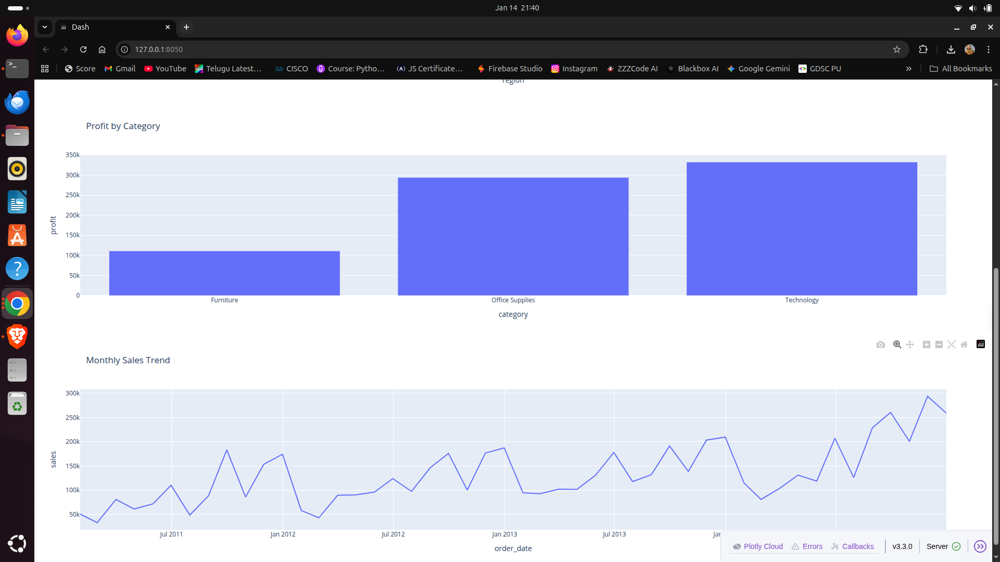

# Business Performance Analytics Dashboard 📊

An end-to-end data analytics project that analyzes retail business performance using SQL, Python, and an interactive Power BI–like dashboard built with Dash.

---

## 🔍 Project Overview

This project analyzes a real-world **Global Superstore retail dataset (51,290 records)** to evaluate business performance and profitability.

The project covers:
- Data analysis using SQL and Python
- Business insights generation
- An interactive dashboard similar to Power BI

---

## 🛠️ Tools & Technologies

- **SQL (MySQL)** – Data storage and KPI analysis  
- **Python (Pandas, Matplotlib, Seaborn)** – Data analysis  
- **Dash & Plotly** – Interactive dashboard  
- **Jupyter Notebook** – Exploratory analysis  
- **Git & GitHub** – Version control  

---

## 📊 Key Features

- KPI cards: Total Sales, Total Profit, Total Quantity  
- Interactive filters by Region and Category  
- Sales vs Profit analysis by Region  
- Monthly Sales & Profit trend analysis  

---

## 🚨 Key Business Insights

- Technology is the highest profit-generating category  
- Furniture shows lower profitability compared to other categories  
- Certain regions generate high sales but comparatively lower profit  
- Discounting and logistics impact profitability trends  

---

## 📈 Dashboard & Analysis Preview

### Interactive Dashboard



### Monthly Sales & Profit Trend


### Sales vs Profit by Region


---

## ▶️ How to Run the Project

```bash
# Clone repository
git clone https://github.com/RajMaheshP/Business-Performance-Analytics.git

# Navigate to project folder
cd Business-Performance-Analytics

# Create virtual environment
python3 -m venv venv
source venv/bin/activate

# Install dependencies
pip install -r requirements.txt

# Run dashboard
python3 dashboard.py

